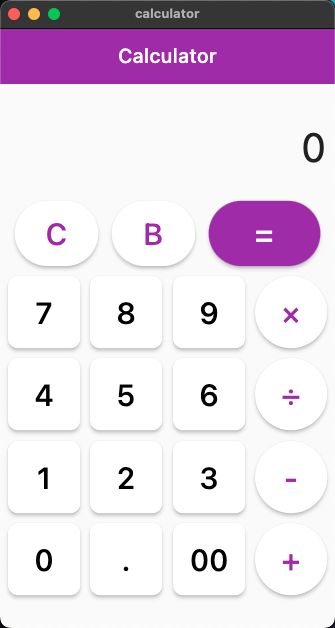
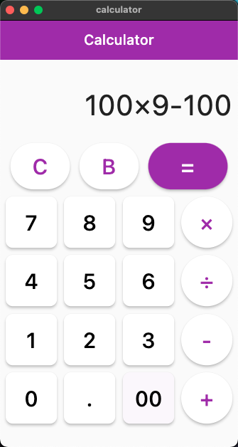
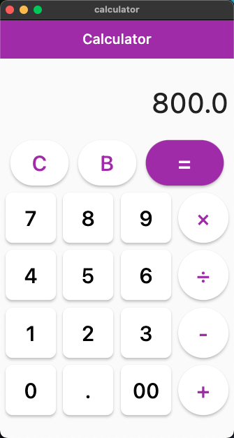

# Flutter Calculator

A simple calculator made with flutter

## Getting Started

`git clone https://github.com/dotsehyde/flutter-calculator.git`

`cd <dir>`

`flutter pub get && flutter run`

## Screenshots

